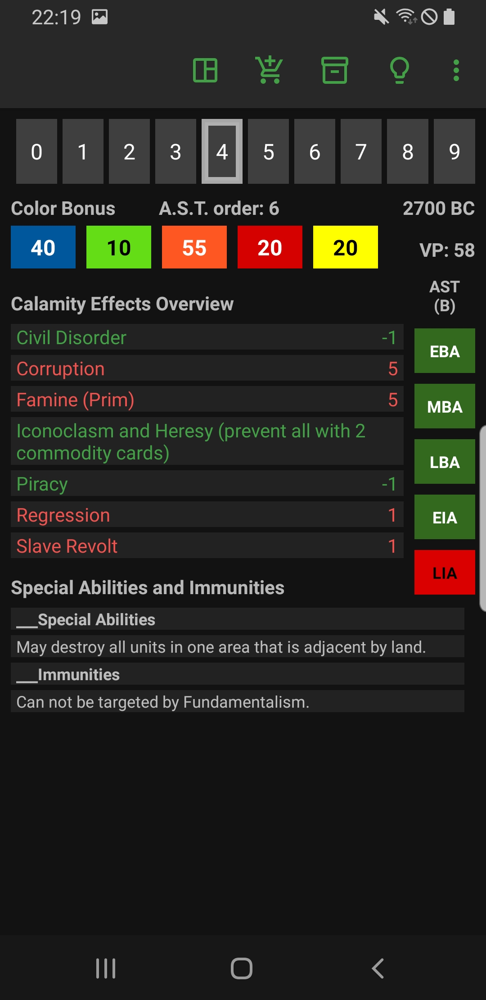
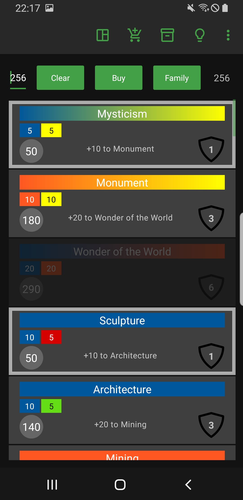
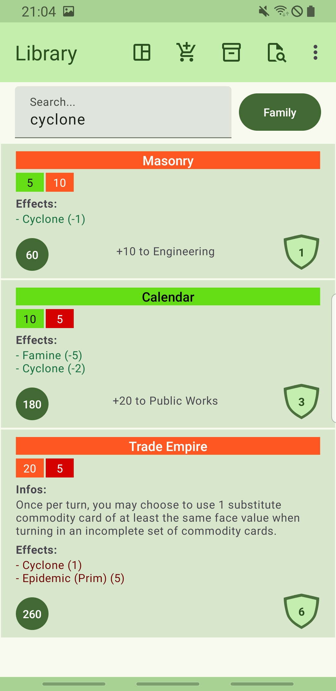
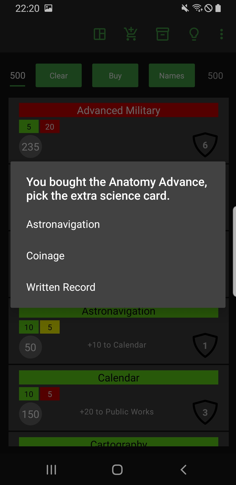
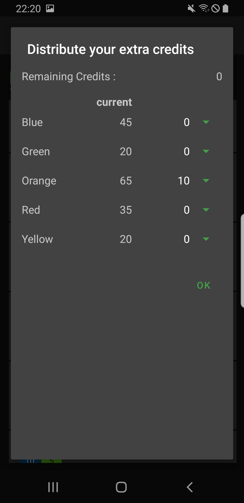
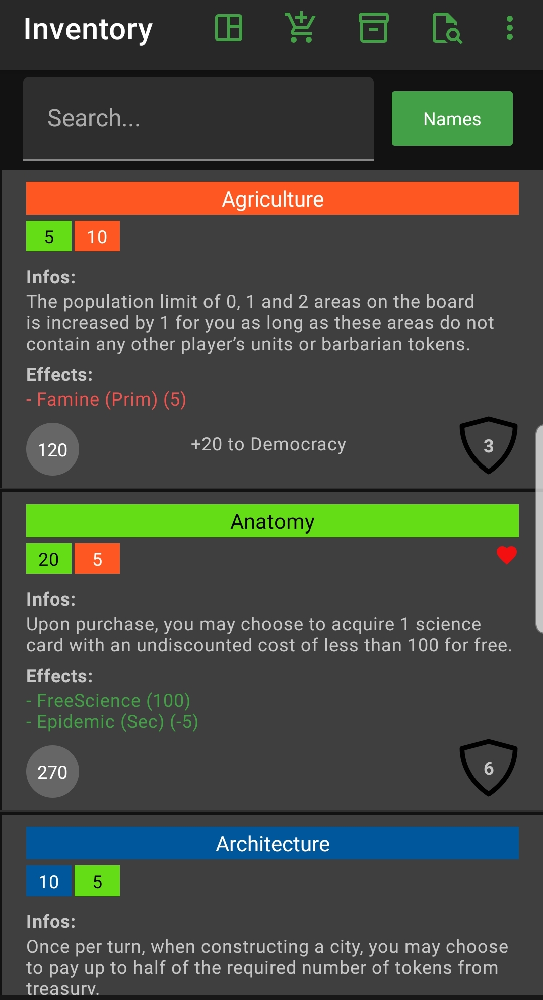
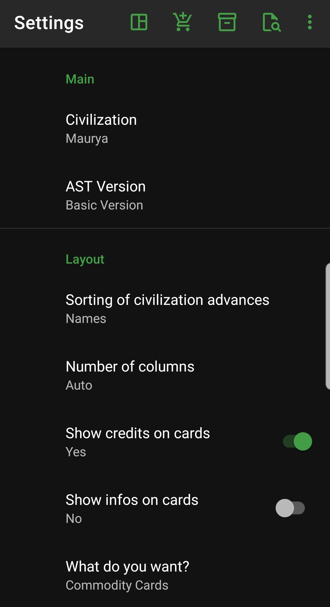
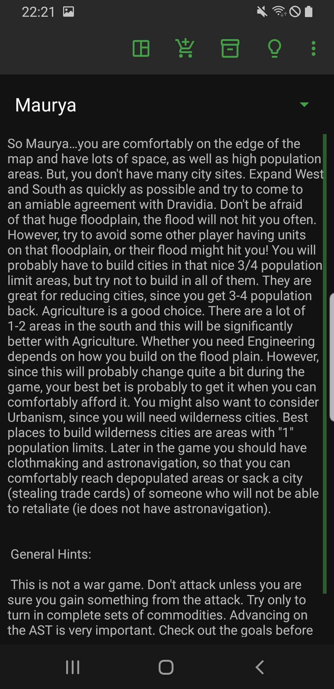
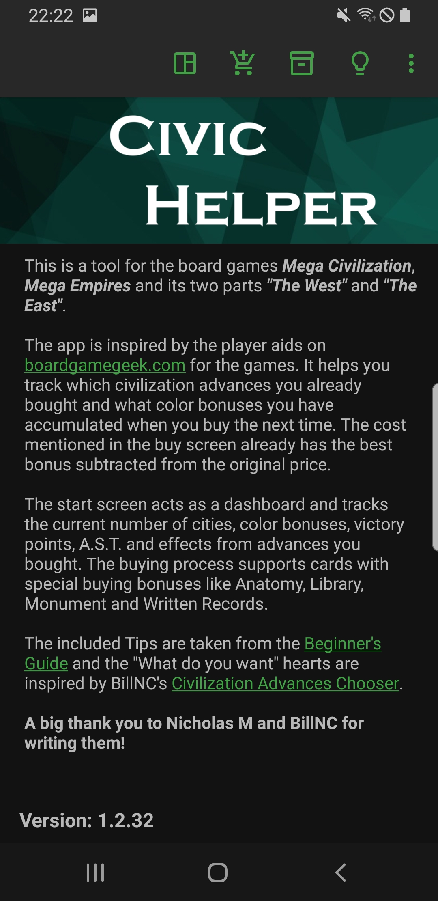

# Civic Helper

This is a tool for the board games *Mega Civilization*,
*Mega Empires* and its two parts *"The West"* and *"The East"*.

The app is inspired by the player aids
on [boardgamegeek](https://boardgamegeek.com/boardgame/184424/mega-civilization) for the games.
It helps you track which civilization advances you already bought and what color bonuses you have
when you go shopping for new advances the next time. The cost mentioned in the buy screen already
has the best bonus subtracted from the original price.

The start screen acts as a dashboard and tracks the current number of cities, color bonuses,
victory points, A.S.T. and effects from advances you bought.

The buying process supports cards with special buying bonuses like Anatomy, Library, Monument and
Written Records.

## Credits

The included Tips are taken from
the [Beginner's Guide](https://boardgamegeek.com/filepage/125855/beginners-guide-for-the-different-nations")
and the "What do you want" hearts are inspired by BillNC's
[Civilization Advances Chooser](https://boardgamegeek.com/filepage/218745/mega-civilization-civilization-advances-chooser).

**A big thank you to Nicholas M and BillNC for writing them!**

> This is not a war game.

This is still the first thing we explain to new people.

## Install

You can find the app on
the [Google Playstore](https://play.google.com/store/apps/details?id=org.tesira.civic) or compile it
yourself.
I used Android Studio and the files you need should all be in this github.

## How To Use It

### Home

The home screen acts as a dashboard, where you can select your number of cities, change the year the
game is (long press the date) and have a quick overview of effects and abilities you got through
buying advances. Long press on the A.S.T. head lets you choose between the basic and expert game
version. Beneath you have colour indicators showing you, if you meet the criteria for the eras you
move through during the game.

### Buying

With the other icons in the action bar, you can navigate to the buying screen to
buy more advances. The app already subtracts the best bonus for every card, so what you see in the
buying screen is not the original price, but always your best price. If you ever get an advance down
to zero due to your accumulated bonuses, it will be auto select next time you enter the screen.
Pressing the button to the right cycles through different ways to sort the list. Long press it to
get a list of options. The app supports Library, Anatomy, Monument and Written Record, for extra
credits on select or choosing your extra advance.

### Inventory

Shows you every advance you already bought with a full text search if you are looking for something
specific.

You can remove advances you get by swapping them left.

### Library

Basically like your Inventory screen, but always shows all advances available in the game.

### Tips

Some info about the civilization you play and what advances you might have to buy in order to make
it work.

### New Game

Starts a new game by resetting everything back to zero and lets you select the number of players,
the game version (basic or expert) and your civilization.

### Settings

The "What do you want" section lets you choose different play style. It will show little hearts for
you on the screens with a list of advances (buying, inventory and library) depending on what you
select here. "Custom" lets you select your own advances.

The "Number of Players" option changes the starting credits in your game 
(10 credits for 3, 5 credits for 4, 0 otherwise).

## Screenshots

