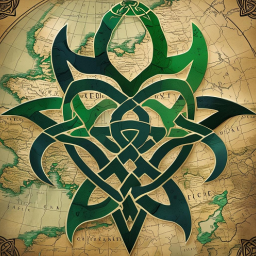
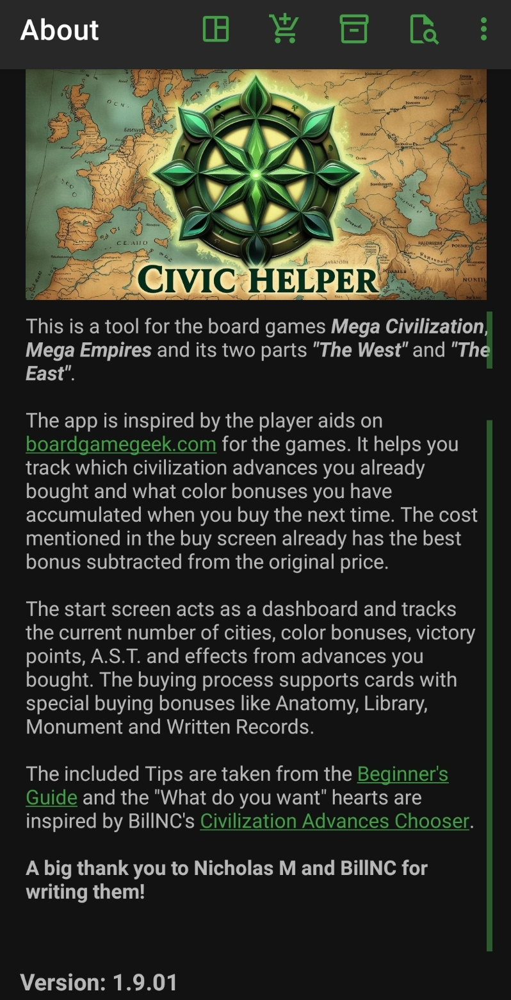

# Civic Helper

This is a tool for the board games *Mega Civilization*,
*Mega Empires* and its two parts *"The West"* and *"The East"*.

The app is inspired by the player aids
on [boardgamegeek](https://boardgamegeek.com/boardgame/184424/mega-civilization) for the games.
It helps you track which civilization advances you already bought and what color bonuses you have
when you go shopping for new advances the next time. The cost mentioned in the buy screen already
has the best bonus subtracted from the original price.

The start screen acts as a dashboard and tracks the current number of cities, color bonuses,
victory points, A.S.T. and effects from advances you bought.

The buying process supports cards with special buying bonuses like Anatomy, Library, Monument and
Written Records.

## Credits

The included Tips are taken from
the [Beginner's Guide](https://boardgamegeek.com/filepage/125855/beginners-guide-for-the-different-nations")
and the "What do you want" hearts are inspired by BillNC's
[Civilization Advances Chooser](https://boardgamegeek.com/filepage/218745/mega-civilization-civilization-advances-chooser).

**A big thank you to Nicholas M and BillNC for writing them!**

> This is not a war game.

This is still the first thing we explain to new people.

## Install

You can find the app on
the [Google Playstore](https://play.google.com/store/apps/details?id=org.tesira.civic) or compile it
yourself.
I used Android Studio and the files you need should all be in this github.

## Screenshots

